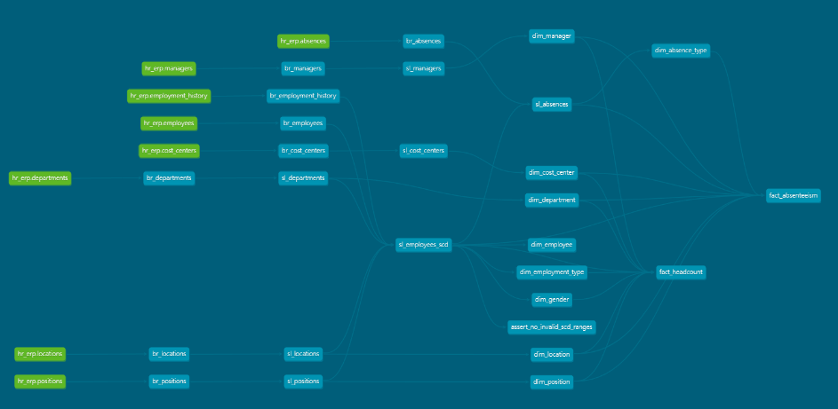

# People Analytics — Arquitetura Medalhão

Pipeline local e reproduzível de People Analytics usando PostgreSQL, Python, dbt Core e uma camada Gold em esquema estrela pronta para Power BI. O conjunto de dados é sintético, gerado com Faker, e não contém dados pessoais reais.

## Arquitetura

```text
Faker/Python -> PostgreSQL Bronze (ERP/RH bruto) -> dbt Silver (qualidade + SCD 2) -> dbt Gold (Kimball) -> Power BI
```

| Camada | Finalidade | Implementação |
|---|---|---|
| Bronze | Dados brutos, rastreáveis por lote e origem | Tabelas `bronze.*` carregadas pelo Python |
| Silver | Deduplicação, limpeza, padronização e integridade | Modelos `sl_*` do dbt |
| Gold | Métricas analíticas no padrão Kimball | Dimensões e fatos no schema `gold` |

Todos os registros Bronze possuem `ingestion_date`, `source_system` e `batch_id`. A Silver transforma os registros em entidades consistentes e aplica chaves técnicas hash. `sl_employees_scd` é a dimensão histórica de colaboradores: cada promoção, transferência ou troca de gestor cria uma nova vigência (SCD Tipo 2).

## Pré-requisitos

- Docker Desktop com Docker Compose
- Python 3.12
- Power BI Desktop (opcional)

## Instalação e execução

1. Crie e ative um ambiente virtual:

```powershell
py -3.12 -m venv .venv
.\.venv\Scripts\Activate.ps1
```

2. Instale as bibliotecas:

```powershell
pip install -r requirements.txt
```

3. Revise `.env` e inicie o PostgreSQL:

```powershell
docker compose up -d
docker compose ps
```

Espere o healthcheck do serviço `postgres` ficar `healthy`. Os scripts em `database/` são executados automaticamente somente quando o volume está vazio. Para reinicializar o banco durante desenvolvimento, execute `docker compose down -v` e depois `docker compose up -d`.

4. Gere e carregue a Bronze:

```powershell
python generator/main.py
```

O carregamento é idempotente: ele limpa as tabelas Bronze e as recarrega em um novo lote. São gerados aproximadamente 1.500 colaboradores, 24 meses (2024-07 a 2026-06), eventos de admissões, desligamentos, promoções, transferências e alterações de gestor, além de 12.000 ausências consistentes com a vigência do contrato.

5. Configure e execute dbt:

```powershell
Copy-Item dbt/profiles.yml.example dbt/profiles.yml
dbt deps --project-dir dbt --profiles-dir dbt
dbt build --project-dir dbt --profiles-dir dbt
dbt docs generate --project-dir dbt --profiles-dir dbt
dbt docs serve --project-dir dbt --profiles-dir dbt
```

`dbt build` executa os modelos e os testes. O arquivo `profiles.yml` é ignorado pelo Git para que credenciais locais não sejam versionadas. Caso execute o dbt em outro host/container, ajuste `host`, porta e credenciais no perfil.

## Consultas de verificação

As consultas de validação analítica estão organizadas e estruturadas na pasta `queries/`, separadas por assunto e prontas para execução no VS Code utilizando o atalho configurado para PostgreSQL (`Ctrl + Enter`):

*   **Headcount (`hc_`)**:
    *   `queries/hc_department.sql`: Headcount ativo por departamento no último mês processado.
    *   `queries/hc_employment_type.sql`: Proporção e distribuição dos tipos de contratação atuais.
*   **Movimentação e Turnover (`mov_`)**:
    *   `queries/mov_monthly_hires.sql`: Histórico mensal de novas contratações/admissões.
    *   `queries/mov_monthly_terminations.sql`: Histórico mensal de desligamentos/demissões.
    *   `queries/mov_turnover_validation.sql`: Taxa de turnover calculada para o último mês disponível.
*   **Absenteísmo (`abs_`)**:
    *   `queries/abs_reasons_and_hours.sql`: Total de horas perdidas, ocorrências e média por tipo de falta.
    *   `queries/abs_global_rate.sql`: Cálculo da taxa de absenteísmo global histórica da organização.

Para checagens rápidas diretamente via terminal interativo dentro do container, utilize o comando:

```powershell
docker compose exec postgres psql -U people_admin -d people_analytics
```

## Modelo Gold (Star Schema)

As dimensões usam surrogate keys; as chaves naturais são preservadas para rastreabilidade.

```text
DimDate, DimEmployee (SCD 2), DimDepartment, DimPosition, DimManager,
DimLocation, DimCostCenter, DimEmploymentType e DimGender -> FactHeadcount

DimDate, DimEmployee, DimDepartment, DimPosition, DimManager,
DimLocation, DimCostCenter e DimAbsenceType -> FactAbsenteeism
```

- `gold."FactHeadcount"`: grão colaborador × último dia do mês; permite tendência mensal e headcount por atributos históricos.
- `gold."FactAbsenteeism"`: grão por lançamento de ausência; contém horas, tipo e atributos organizacionais vigentes na data da ausência.
- `gold."DimEmployee"`: histórico SCD 2 por `effective_start_date` e `effective_end_date`.

## Estrutura e boas práticas

- `database/`: DDL de inicialização do PostgreSQL.
- `generator/`: gerador e carregador Python para Bronze.
- `queries/`: scripts SQL analíticos de validação, padronizados em inglês e segregados por assunto (`hc_`, `mov_`, `abs_`).
- `dbt/`: transformações, macros, testes e documentação dbt.
- `notebooks/`, `docs/` e `powerbi/`: espaços para exploração, documentação e consumo analítico.
- Container com volume persistente, variáveis em `.env` e healthcheck.
- Carga transacional e inserções em lotes via SQLAlchemy/Pandas.
- Testes dbt `unique`, `not_null`, `relationships`, `accepted_values` e teste singular de vigência SCD.

## Documentação Visual e Validação

Para facilitar o entendimento da arquitetura do projeto e garantir a transparência da qualidade dos dados, seguem os principais artefatos visuais.

### Diagrama de Linhagem de Dados (dbt Lineage)

O diagrama abaixo apresenta o fluxo completo dos dados, desde as tabelas de origem (raw) até as tabelas analíticas finais, demonstrando as transformações realizadas pelo dbt para a construção dos modelos **`fact_absenteeism`** e **`fact_headcount`**.



---

### Validação e Testes de Qualidade

A imagem abaixo apresenta a execução dos testes do dbt, validando a integridade, consistência e qualidade dos dados do projeto.

Todos os **40 testes** foram executados com sucesso:

- ✔️ PASS = **40**
- ❌ FAIL = **0**


## Próximos Passos & Roadmap de Evolução

O projeto foi estruturado para ser incremental. As seguintes evoluções estão planejadas para as próximas sprints:

1. **📊 Dashboards no Power BI**: Desenvolver o relatório executivo de People Analytics focado em três visões principais: Demográfica (Headcount/Turnover), Financeira (Centro de Custo/Tipo de Contrato) e Operacional (Absenteísmo).
2. **🤖 Analytics Preditivo (Machine Learning)**: Integrar um modelo de classificação em Python para prever a probabilidade de *Churn* (demissão voluntária) de colaboradores com base no histórico da camada Gold.
3. **⚙️ Orquestração com Apache Airflow ou Prefect**: Substituir a execução manual dos scripts Python e comandos dbt por um orquestrador que automatize a carga diária/mensal e monitore falhas.
4. **🧪 Observabilidade de Dados**: Implementar o pacote `dbt-elementary` ou *Great Expectations* para gerar alertas automáticos caso haja anomalias críticas nos dados de RH (ex: headcount zerado ou picos estranhos de demissões).
